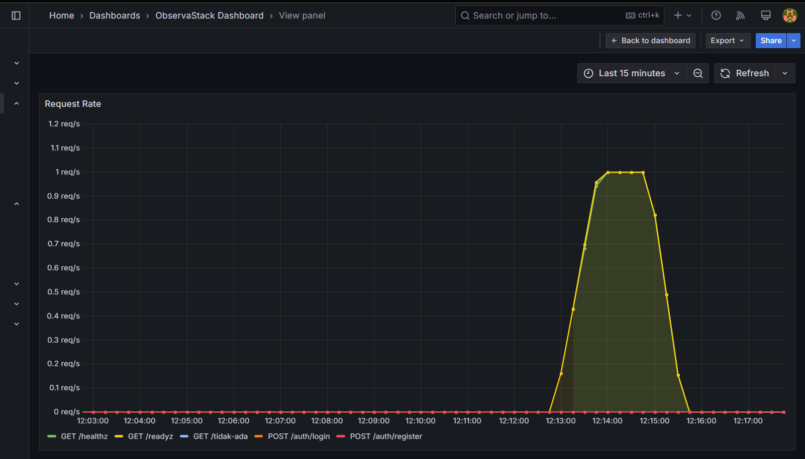
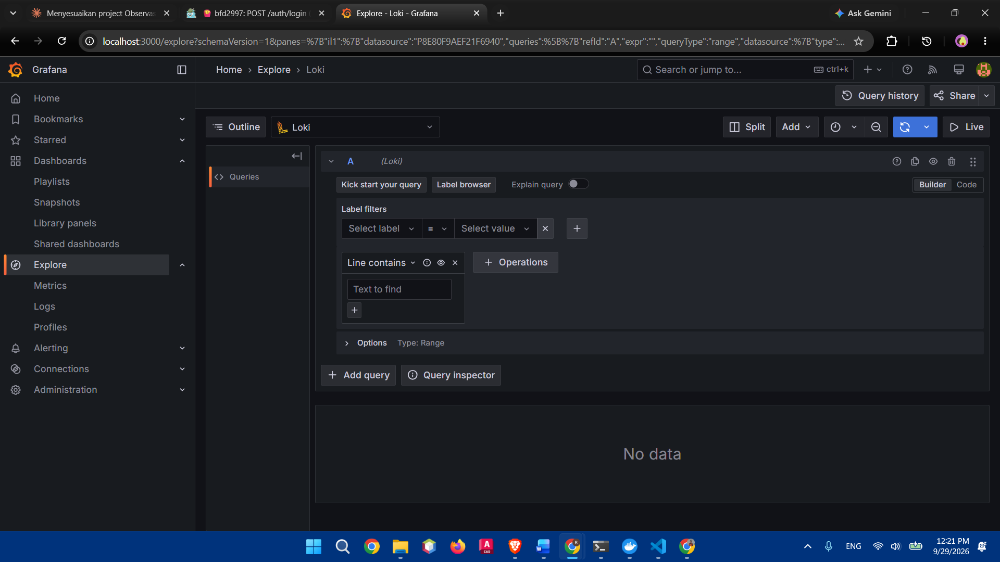
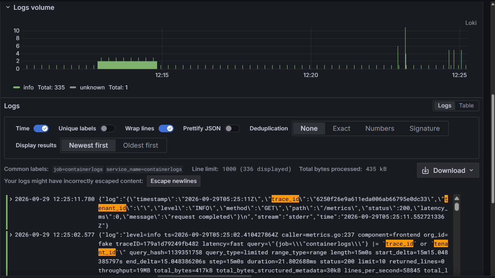

# ObservaStack

SaaS backend multi-tenant dengan full observability stack (metrics, logs, tracing) — dibangun untuk
menunjukkan kemampuan backend engineering + DevOps production-grade, bukan sekadar CRUD API.

## Dokumentasi
Semua dokumen kebutuhan project ada di folder `docs/`:

| File | Isi |
|------|-----|
| `docs/PRD.md` | Requirement produk: tujuan, scope, user stories |
| `docs/ARCHITECTURE.md` | Desain sistem, alur request, prinsip desain |
| `docs/TECH_STACK.md` | Daftar teknologi & versi yang dipakai |
| `docs/API_SPEC.md` | Kontrak API (endpoint, request/response, error code) |
| `docs/DATABASE_SCHEMA.md` | Struktur tabel database |
| `docs/CODING_STANDARDS.md` | Konvensi kode & checklist review |
| `docs/ROADMAP.md` | Rencana kerja mingguan & status task |
| `docs/DECISIONS.md` | Histori keputusan teknis (ADR) |

Kalau kamu pakai AI coding agent (Claude Code, Cursor, dll), agent akan otomatis baca `AGENTS.md`
di root repo ini sebagai entry point konteks.

## Quickstart

```bash
cp .env.example .env        # Windows CMD: copy .env.example .env
# isi JWT_SECRET dan password di .env (lihat komentar di file)
docker compose -f deploy/docker-compose.yml --env-file .env up -d
docker compose -f deploy/docker-compose.yml --env-file .env logs -f app
```

Setelah semua service jalan:

- API: <http://localhost:8080>
- Grafana: <http://localhost:3000> (default `admin`/`admin`, hanya untuk development)
- Prometheus: <http://localhost:9090>
- Jaeger UI: <http://localhost:16686>

Rasio sampling trace diatur lewat `OTEL_TRACE_SAMPLE_RATIO` (default `0.1`; pakai `1.0` untuk demo lokal).

## Contoh Hasil

**Distributed tracing (Jaeger)** — satu request `POST /auth/login` menghasilkan trace dengan span rate limiter (Redis), query PostgreSQL, dan verifikasi password. Dari trace ini terlihat bahwa sebagian besar latensi login berasal dari verifikasi password.


**Metrics (Grafana)** — request rate per endpoint.


**Logs (Loki)** — log terstruktur yang memuat `trace_id`, sehingga log bisa dikaitkan ke trace di Jaeger.


## Struktur Repo
```
.
├── AGENTS.md              # entry point konteks untuk AI agent
├── README.md
├── .env.example
├── docs/                  # semua dokumen requirement & arsitektur
├── deploy/                # docker-compose, config prometheus/loki/grafana
├── cmd/                   # entrypoint aplikasi
├── internal/              # source code utama
└── migrations/            # SQL migration
```

## Status

Sudah berjalan:

- Autentikasi: register, login, refresh, dan logout (JWT + refresh token) dengan rate limiting per IP dan per email
- Observability: metrics (Prometheus, Grafana), logs (Loki, Promtail), dan tracing OpenTelemetry sampai level query PostgreSQL dan Redis (Jaeger)
- CI dengan GitHub Actions dan golangci-lint

Direncanakan: manajemen tenant dan resource task (lihat `docs/ROADMAP.md`).
